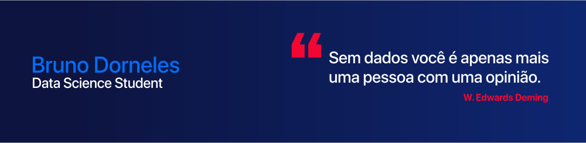

   [![contributions welcome]

  

# Bruno Dorneles
*Data Science Student

Graduado pela Universidade Federal da Grande Dourados (UFGD) no curso de Engenharia de Computação. Durante minha graduação realizei pesquisa científica na área de Machine Learning, mais especificamente na utilização de Support Vector Machines para identificar relatos depressivos em redes sociais. A pesquisa continua sendo desenvolvida realizando a aplicação de técnicas de balanceamento de classes e Ensemble Learning.

Fascinado por resolver problemas reais, mantenho uma rotina diária de estudos em Machine Learning com objetivo de conquistar uma oportunidade na área e aplicar o conhecimento adquirido na resolução de problemas enfrentados diariamente pelas pessoas. 

**Background in:** Python, Machine Learning.

**Links:**
* [LinkedIn](https://www.linkedin.com/in/bruno-dorneles/)
